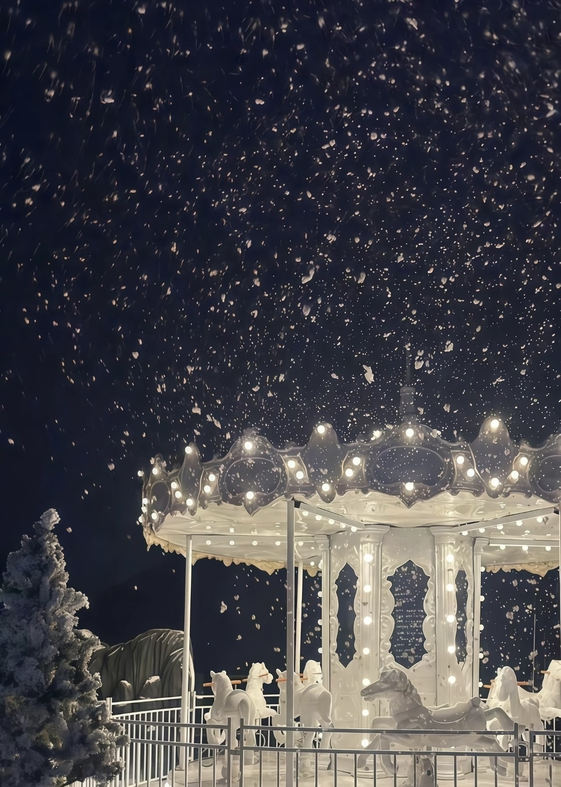
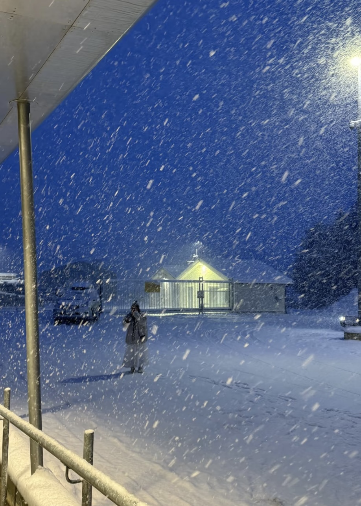
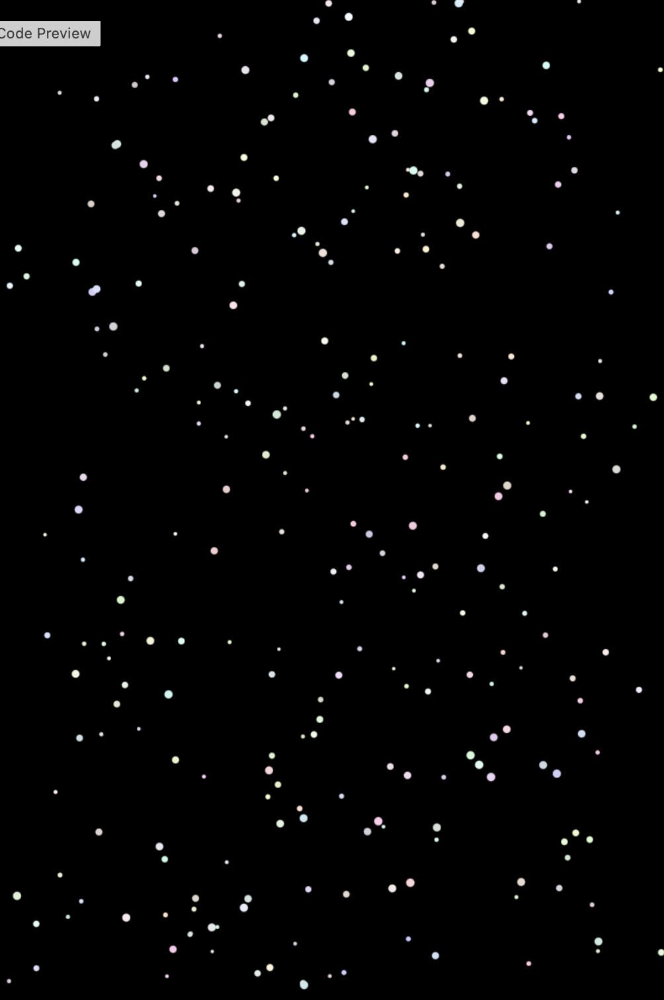

# fali0101_9104_tut1s

## Part 1: Imaging Technique Inspiration

**Falling Snow Motion**

The inspiration comes from these two photos of snow at night. What interests me most is how the snow is captured as movement rather than just static shapes, creating a natural falling snow effect.

In the first image, the snow looks fast and directional. The flakes are stretched and uneven, which makes the motion feel strong and a bit chaotic. In the second image, the snow appears more gentle and evenly spread, creating a calmer and softer feeling. It keeps changing over time, which makes it feel more alive.

For my project, this idea could be useful to create background atmosphere or subtle motion, instead of just using still visuals. It can also make the experience feel more engaging.

## Part 2: Coding Technique Exploration

**Using Class + Array to Build a Particle System**

This example uses a class (Snowflake) and an array (snowflakes[]) to manage multiple moving objects.

Each snowflake has its own properties like position, size, speed, and color. In the update() function, the snowflake moves down the screen and slightly left and right using a sine wave (sin()), which makes the motion look more natural instead of straight falling.

The draw() loop updates and displays all snowflakes every frame, creating continuous animation.

I think this method is useful because it makes it easy to control many elements at once and adjust their behaviour individually.

[A link to this example](https://p5js.org/examples/classes-and-objects-snowflakes/)